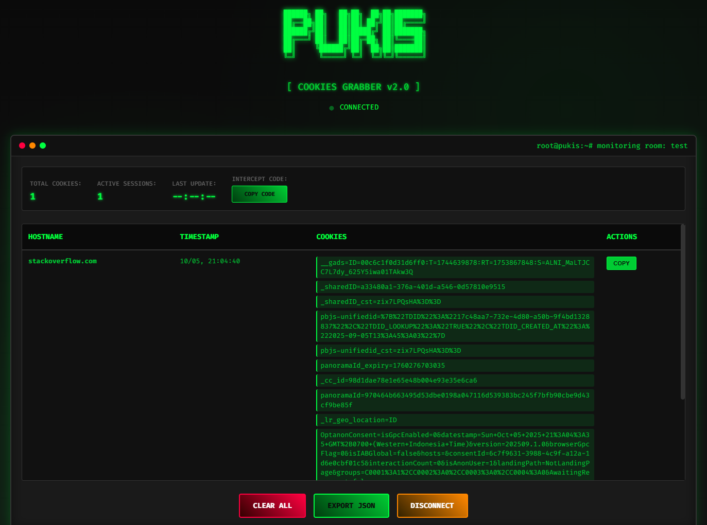

# Pukis - Cookies Grabber

## ⚠️ **DISCLAIMER - EDUCATIONAL PURPOSE ONLY**

**🚨 PERINGATAN KERAS / STRONG WARNING 🚨**

**BAHASA INDONESIA:**
- Aplikasi ini dibuat **HANYA UNTUK TUJUAN EDUKASI** dan pembelajaran keamanan siber
- **DILARANG KERAS** menggunakan aplikasi ini untuk tujuan ilegal, merugikan orang lain, atau melanggar privasi
- Penggunaan aplikasi ini untuk aktivitas yang melanggar hukum adalah **TANGGUNG JAWAB PENGGUNA SEPENUHNYA**
- Developer **TIDAK BERTANGGUNG JAWAB** atas segala penyalahgunaan aplikasi ini
- Gunakan hanya untuk testing pada sistem yang Anda miliki atau dengan izin eksplisit

**ENGLISH:**
- This application is created **FOR EDUCATIONAL PURPOSES ONLY** and cybersecurity learning
- It is **STRICTLY PROHIBITED** to use this application for illegal purposes, harming others, or violating privacy
- Using this application for activities that violate the law is **ENTIRELY THE USER'S RESPONSIBILITY**
- The developer is **NOT RESPONSIBLE** for any misuse of this application
- Use only for testing on systems you own or with explicit permission


## 🌐 Demo

**Live Demo:** https://pukis.jefripunza.com/

### Screenshots

#### Home Page - Room ID Input

*Enter a room ID to start monitoring cookies*

#### Listening Page - Cookie Monitoring

*Real-time cookie monitoring with parsed data and copy functionality*

## 🎓 Educational Features

This project demonstrates:
- WebSocket real-time communication
- Cookie handling and parsing
- Room-based data management
- Modern web security concepts
- Client-server architecture

## 🛠️ Installation

To install dependencies:

```bash
bun install
```

## 🚀 Usage

### Development Mode
```bash
bun run dev
```

### Production Build
```bash
bun run compile
./pukis.exe
```

### Direct Run
```bash
bun run index.ts
```

## 📋 API Endpoints

- `GET /` - Main panel interface
- `POST /send/:room_id` - Send cookies to room
- `GET /room/:room_id` - Get room data
- `GET /rooms` - List all rooms

## 🔧 Technical Stack

- **Runtime:** Bun v1.2.10+
- **Backend:** TypeScript, Express.js, Socket.IO
- **Frontend:** Vanilla JavaScript, CSS3, HTML5
- **Real-time:** WebSocket communication

## ⚖️ Legal Notice

By using this software, you acknowledge that:
1. You understand this is for educational purposes only
2. You will not use it for illegal activities
3. You take full responsibility for your actions
4. You comply with all applicable laws and regulations

**Remember: With great power comes great responsibility. Use wisely and ethically.**
